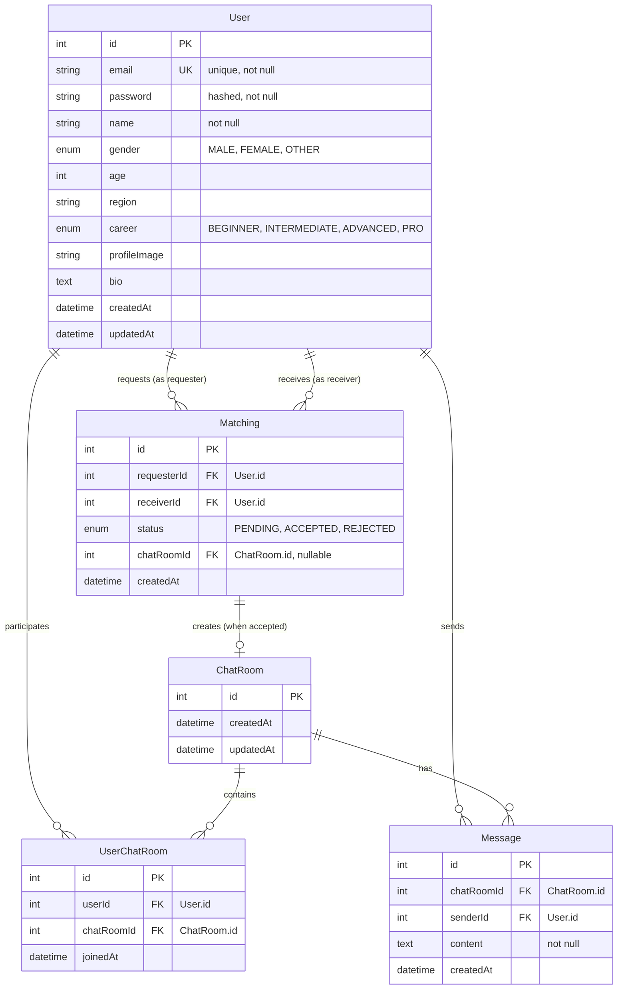

# 📊 Database ERD (Entity Relationship Diagram)

## 개요

Health Partner 애플리케이션의 데이터베이스 스키마 설계 문서입니다.

## ERD 다이어그램



## 테이블 상세 설명

### 1. User (사용자)

사용자 계정 및 프로필 정보를 저장합니다.

| 컬럼명 | 타입 | 제약조건 | 설명 |
|--------|------|----------|------|
| id | Int | PK, Auto Increment | 사용자 고유 ID |
| email | String | Unique, Not Null | 로그인용 이메일 |
| password | String | Not Null | bcrypt 해시된 비밀번호 |
| name | String | Not Null | 사용자 이름 |
| gender | Enum | Nullable | 성별 (MALE, FEMALE, OTHER) |
| age | Int | Nullable | 나이 |
| region | String | Nullable | 활동 지역 |
| career | Enum | Nullable | 운동 경력 (BEGINNER, INTERMEDIATE, ADVANCED, PRO) |
| profileImage | String | Nullable | 프로필 이미지 URL |
| bio | Text | Nullable | 자기소개 |
| createdAt | DateTime | Default: now() | 계정 생성일 |
| updatedAt | DateTime | Auto Update | 정보 수정일 |

**관계:**
- `Matching` 테이블과 1:N 관계 (요청자로서)
- `Matching` 테이블과 1:N 관계 (수신자로서)
- `Message` 테이블과 1:N 관계 (발신자로서)
- `UserChatRoom` 테이블과 1:N 관계 (참여자로서)

### 2. Matching (매칭 요청)

사용자 간 운동 파트너 매칭 요청을 관리합니다.

| 컬럼명 | 타입 | 제약조건 | 설명 |
|--------|------|----------|------|
| id | Int | PK, Auto Increment | 매칭 요청 고유 ID |
| requesterId | Int | FK (User.id), Not Null | 요청 보낸 사용자 ID |
| receiverId | Int | FK (User.id), Not Null | 요청 받은 사용자 ID |
| status | Enum | Not Null, Default: PENDING | 요청 상태 (PENDING, ACCEPTED, REJECTED) |
| chatRoomId | Int | FK (ChatRoom.id), Nullable | 수락 시 생성된 채팅방 ID |
| createdAt | DateTime | Default: now() | 요청 생성일 |

**관계:**
- `User` 테이블과 N:1 관계 (requester)
- `User` 테이블과 N:1 관계 (receiver)
- `ChatRoom` 테이블과 1:1 관계 (수락 시)

**비즈니스 로직:**
- 요청이 `ACCEPTED` 상태로 변경되면 자동으로 `ChatRoom`이 생성됨
- 동일한 사용자 쌍에 대해 중복 요청 방지 (애플리케이션 레벨)

### 3. ChatRoom (채팅방)

매칭 성사 후 생성되는 1:1 채팅방입니다.

| 컬럼명 | 타입 | 제약조건 | 설명 |
|--------|------|----------|------|
| id | Int | PK, Auto Increment | 채팅방 고유 ID |
| createdAt | DateTime | Default: now() | 채팅방 생성일 |
| updatedAt | DateTime | Auto Update | 마지막 활동 시간 |

**관계:**
- `UserChatRoom` 테이블과 1:N 관계
- `Message` 테이블과 1:N 관계
- `Matching` 테이블과 1:1 관계

### 4. UserChatRoom (사용자-채팅방 연결)

사용자와 채팅방의 다대다 관계를 관리하는 중간 테이블입니다.

| 컬럼명 | 타입 | 제약조건 | 설명 |
|--------|------|----------|------|
| id | Int | PK, Auto Increment | 연결 고유 ID |
| userId | Int | FK (User.id), Not Null | 사용자 ID |
| chatRoomId | Int | FK (ChatRoom.id), Not Null | 채팅방 ID |
| joinedAt | DateTime | Default: now() | 참여 시작 시간 |

**관계:**
- `User` 테이블과 N:1 관계
- `ChatRoom` 테이블과 N:1 관계

**복합 유니크 제약:**
- `(userId, chatRoomId)` 조합은 유니크해야 함

### 5. Message (메시지)

채팅방 내 메시지를 저장합니다.

| 컬럼명 | 타입 | 제약조건 | 설명 |
|--------|------|----------|------|
| id | Int | PK, Auto Increment | 메시지 고유 ID |
| chatRoomId | Int | FK (ChatRoom.id), Not Null | 채팅방 ID |
| senderId | Int | FK (User.id), Not Null | 발신자 ID |
| content | Text | Not Null | 메시지 내용 |
| createdAt | DateTime | Default: now() | 메시지 전송 시간 |

**관계:**
- `ChatRoom` 테이블과 N:1 관계
- `User` 테이블과 N:1 관계 (sender)

## Enum 타입 정의

### Gender (성별)
```typescript
enum Gender {
  MALE   = "MALE"
  FEMALE = "FEMALE"
  OTHER  = "OTHER"
}
```

### Career (운동 경력)
```typescript
enum Career {
  BEGINNER     = "BEGINNER"      // 헬린이
  INTERMEDIATE = "INTERMEDIATE"  // 중급자
  ADVANCED     = "ADVANCED"      // 고수
  PRO          = "PRO"           // 전문가
}
```

### MatchingStatus (매칭 상태)
```typescript
enum MatchingStatus {
  PENDING  = "PENDING"   // 대기 중
  ACCEPTED = "ACCEPTED"  // 수락됨
  REJECTED = "REJECTED"  // 거절됨
}
```

## 주요 쿼리 패턴

### 1. 매칭 후보 조회
```sql
SELECT * FROM User
WHERE id NOT IN (
  SELECT receiverId FROM Matching WHERE requesterId = :currentUserId
  UNION
  SELECT requesterId FROM Matching WHERE receiverId = :currentUserId
)
AND id != :currentUserId;
```

### 2. 받은 요청 조회
```sql
SELECT m.*, u.* FROM Matching m
JOIN User u ON m.requesterId = u.id
WHERE m.receiverId = :currentUserId
AND m.status = 'PENDING';
```

### 3. 채팅방 목록 조회
```sql
SELECT cr.*, u.* FROM ChatRoom cr
JOIN UserChatRoom ucr ON cr.id = ucr.chatRoomId
JOIN UserChatRoom partner_ucr ON cr.id = partner_ucr.chatRoomId
JOIN User u ON partner_ucr.userId = u.id
WHERE ucr.userId = :currentUserId
AND partner_ucr.userId != :currentUserId;
```

## 인덱스 전략

성능 최적화를 위한 권장 인덱스:

```sql
-- User 테이블
CREATE INDEX idx_user_email ON User(email);

-- Matching 테이블
CREATE INDEX idx_matching_requester ON Matching(requesterId);
CREATE INDEX idx_matching_receiver ON Matching(receiverId);
CREATE INDEX idx_matching_status ON Matching(status);

-- UserChatRoom 테이블
CREATE INDEX idx_ucr_user ON UserChatRoom(userId);
CREATE INDEX idx_ucr_chatroom ON UserChatRoom(chatRoomId);

-- Message 테이블
CREATE INDEX idx_message_chatroom ON Message(chatRoomId);
CREATE INDEX idx_message_created ON Message(createdAt DESC);
```

## 마이그레이션 히스토리

### v1.0.0 (Initial Schema)
- User, Matching, ChatRoom, UserChatRoom, Message 테이블 생성
- 기본 Enum 타입 정의
- 외래 키 제약조건 설정

## 참고사항

- Prisma ORM을 사용하여 스키마 관리
- 실제 스키마 파일: `backend/prisma/schema.prisma`
- 마이그레이션 명령어: `npx prisma db push`
- 스키마 시각화: `npx prisma studio` (브라우저에서 확인 가능)
